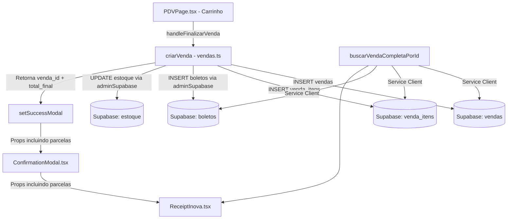

# Arquitetura do Fluxo de Vendas, Recibos e Boletos

> **Objetivo:** Documentar a hierarquia de componentes, fluxo de dados e pontos críticos para que futuras implementações não quebrem o que já funciona.

---

## 1. Fluxo Completo de uma Venda (PDV → Banco → Recibo)



---

## 2. Hierarquia de Componentes

| Componente | Arquivo | Responsabilidade |
|---|---|---|
| **PDVPageInner** | `app/(dashboard)/pdv/page.tsx` | Carrinho, cálculos, parcelas, finalização |
| **ConfirmationModal** | `app/components/ConfirmationModal.tsx` | Tela "Venda Realizada!" + visualização do recibo |
| **ReceiptInova** | `app/components/ReceiptInova.tsx` | Renderização visual do recibo (tela e PDF) |
| **ReciboPage** | `app/recibo/[id]/page.tsx` | Página pública do recibo (SSR, usa `buscarVendaCompletaPorId`) |

---

## 3. Props Obrigatórias do ConfirmationModal

> ⚠️ **CRÍTICO:** Sempre que adicionar um novo dado ao recibo, ele deve ser passado em **TRÊS** pontos:

1. **`setSuccessModal({...})`** em `PDVPage.tsx` (linhas ~309-326) — onde o dado é originado
2. **`<ConfirmationModal ... />`** em `PDVPage.tsx` (linhas ~954-965) — onde o dado é passado como prop
3. **Interface de props** do `ConfirmationModal` (linhas ~5-27) — onde o dado é declarado como tipo

```
Props atuais:
  vendaId, total, subtotal, desconto, formaPagamento,
  data, cliente, itens, parcelas, onNewSale
```

---

## 4. Onde os Dados São Armazenados no Supabase

| Dado | Tabela | Campos-chave | Observação |
|---|---|---|---|
| Venda | `vendas` | `id`, `total`, `desconto`, `total_final` (gerado), `forma_pagamento`, `status` | `total_final` é coluna gerada: `total - desconto` |
| Itens normais | `venda_itens` | `venda_id`, `produto_id`, `preco_unitario`, `quantidade` | Apenas produtos comuns |
| Kits/Combos | `vendas.observacao` | Campo JSON `[SYS_EXTRAS]...[/SYS_EXTRAS]` | Não ficam em `venda_itens`! |
| Parcelas boleto | `boletos` | `venda_id`, `numero_parcela`, `valor`, `data_vencimento`, `status` | Status válidos: `aberto`, `pago_parcial`, `pago`, `vencido`, `cancelado` |
| Estoque | `estoque` | `produto_id`, `quantidade` | Atualizado via `adminSupabase` |
| Movimentações | `movimentacao_estoque` | `produto_id`, `quantidade`, `tipo`, `documento_ref` | Histórico de entradas/saídas |

---

## 5. Clientes Supabase: Quando Usar Qual

| Cliente | Variável | Quando Usar |
|---|---|---|
| **User-level** | `const supabase = await createClient()` | Leituras normais, criação da venda |
| **Service (Admin)** | `const adminSupabase = createServiceClient()` | INSERT em tabelas com RLS restritiva (`boletos`, `estoque`, `movimentacao_estoque`) |

> ⚠️ **Regra:** Se o INSERT falhar silenciosamente, **primeiro verifique as RLS policies** da tabela.

---

## 6. Triggers Ativos no Banco (Pontos de Atenção)

| Trigger | Tabela | Função | Status |
|---|---|---|---|
| `trg_baixar_estoque` | `vendas` | `fn_baixar_estoque()` | ⚠️ Ativo (pode conflitar com lógica do Node.js) |
| `trg_gerar_boletos` | `vendas` | `fn_gerar_boletos()` | ⚠️ Ativo mas **NÃO executa** (só dispara se `status = 'confirmada'`, vendas entram como `'paga'`) |
| `audit_vendas` | `vendas` | `fn_auditoria()` | ✅ Ativo |
| `trg_total_venda` | `venda_itens` | — | ❌ **REMOVIDO** (sobrescrevia total ignorando Kits) |

> ⚠️ **Antes de criar novos triggers**, verifique se o Node.js já faz a mesma operação para evitar duplicação.

---

## 7. CHECK Constraints Importantes

| Tabela | Constraint | Valores Permitidos |
|---|---|---|
| `boletos` | `boletos_status_check` | `aberto`, `pago_parcial`, `pago`, `vencido`, `cancelado` |

> ⚠️ **Sempre consulte constraints** antes de inserir dados com valores de status.

---

## 8. Fluxo de Recuperação do Recibo (Histórico)

Quando o recibo é aberto pelo histórico (`/vendas` → "Ver Recibo") ou pela URL pública (`/recibo/{id}`):

1. `buscarVendaCompletaPorId(vendaId)` em `vendas.ts` é chamada
2. Usa `createServiceClient()` para contornar RLS
3. Busca: `vendas` + `clientes` + `venda_itens` + `produtos` (nomes) + `boletos` (se boleto)
4. Extrai Kits/Combos do campo `observacao` (JSON `[SYS_EXTRAS]`)
5. Retorna objeto padronizado para `<ReceiptInova />`

---

## 9. Regras para Futuras Implementações

1. **Novo campo no recibo?** → Passar em 3 pontos: `setSuccessModal`, `<ConfirmationModal>`, e interface de props
2. **Novo INSERT em tabela?** → Verificar RLS e CHECK constraints antes. Usar `adminSupabase` se necessário
3. **Novo trigger no banco?** → Verificar se o Node.js já executa a mesma lógica
4. **Mexer em `venda_itens`?** → Lembrar que Kits/Combos NÃO ficam lá (ficam em `observacao`)
5. **Imprimir/PDF?** → Classe `.no-print` esconde elementos. Estilos de print estão em `ConfirmationModal.tsx`

---

## 10. Estrutura do Recibo para Impressão/PDF (`ReceiptInova.tsx`)

> ⚠️ **MANUTENÇÃO CRÍTICA:** Leia estas regras antes de alterar qualquer coisa no recibo.

### Arquitetura do Layout

O recibo é um **documento HTML único e contínuo** — NÃO usa paginação manual (chunks/loops).
O navegador é quem decide onde quebrar a página respeitando o tamanho real da folha A4 (210x297mm).

```
┌─────────────────────────────────────────┐
│  @page { size: A4; margin: 10mm 12mm }  │  ← CSS controla tamanho da folha
│                                         │
│  HEADER (logo, empresa, cliente)        │  ← Aparece 1x no topo
│  ─────────────────────────────────      │
│  TABELA DE PRODUTOS (fluxo contínuo)    │  ← thead repete automaticamente
│  item 1                                 │     em cada página impressa
│  item 2                                 │
│  ...                                    │
│  item N                                 │  ← Navegador quebra página aqui
│  ─────────────────────────────────      │     quando a folha A4 acaba
│  FOOTER FINANCEIRO                      │  ← page-break-before: always
│    Forma de pagamento                   │     (sempre começa em pág. nova)
│    Parcelas (se boleto)                 │
│    Subtotal / Desconto / Total          │
│    "Obrigado pela preferência"          │
└─────────────────────────────────────────┘
```

### Classes CSS Importantes (somente em `@media print`)

| Classe | Regra CSS | Propósito |
|---|---|---|
| `.receipt-container` | `width: 100%` | Usa toda a largura da folha A4 |
| `.receipt-item-row` | `page-break-inside: avoid` | Nunca corta uma linha de produto ao meio |
| `.receipt-footer-section` | `page-break-inside: avoid` | **Footer nunca é cortado no meio** — se não cabe, pula inteiro |
| `thead` | `display: table-header-group` | Cabeçalho da tabela repete em cada folha |

### Regras de Manutenção

1. **NÃO adicionar paginação manual** (chunks, `ITENS_POR_PAGINA`, loops de páginas). O navegador faz isso naturalmente via `@page { size: A4 }`.
2. **NÃO alterar o CSS de print** sem testar ambos os caminhos de geração (ver seção 11).
3. **Ao adicionar novos campos no footer** (ex: campo de assinatura), colocá-los DENTRO da div `.receipt-footer-section` para manter o bloco indivisível.
4. **Ao testar alterações**, sempre gerar o PDF com uma venda de MUITOS itens (20+) para verificar que o footer não é cortado.
5. **NÃO usar `maxWidth` no container** — a folha A4 já define o tamanho via `@page`.

---

## 11. Caminhos de Geração do Recibo (UNIFICADOS — Resolução Final)

> ✅ **RESOLVIDO EM 05/03/2026.** Ambos os caminhos agora geram o PDF pela MESMA página limpa `/recibo/[id]`.

### Arquitetura Unificada

```
Caminho 1: PDV → "Venda Realizada!" → "Visualizar Recibo de Luxo" → "Imprimir/PDF"
                                                                        ↓
                                                               window.open('/recibo/{id}')
                                                                        ↓
Caminho 2: Vendas → ícone olho → /recibo/[id] → "Imprimir/Salvar PDF"
                                                                        ↓
                                                               window.print() na página limpa
```

**Resultado:** Output de PDF SEMPRE idêntico, independente de qual caminho o usuário usa.

### Componentes Envolvidos

| Componente | Arquivo | Responsabilidade |
| --- | --- | --- |
| **ReceiptInova** | `app/components/ReceiptInova.tsx` | Renderiza o conteúdo visual do recibo (layout, itens, totais) |
| **ReciboPage** | `app/recibo/[id]/page.tsx` | Página limpa SSR com CSS de print para A4. **Único ponto de impressão.** |
| **PrintButton** | `app/recibo/[id]/PrintButton.tsx` | Botão "Imprimir / Salvar PDF" flutuante |
| **ConfirmationModal** | `app/components/ConfirmationModal.tsx` | Modal "Venda Realizada!", preview do recibo, botão abre `/recibo/[id]` em nova aba |

### Regras Definitivas

1. **NUNCA usar `window.print()` dentro de modais ou overlays** — sempre abrir `/recibo/[id]` em nova aba via `window.open()`
2. **O `ReceiptInova.tsx` é o ÚNICO componente de layout do recibo** — qualquer alteração visual/estrutural é feita nele
3. **CSS de print fica em dois lugares:** `ReceiptInova.tsx` (regras `@page` e classes de quebra) e `page.tsx` do recibo (reset de background/margin)
4. **Usar `display: none`** para esconder elementos no print, NUNCA `visibility: hidden` (este último não esconde backgrounds)
5. **`page-break-inside: avoid`** no `.receipt-footer-section` garante que totais/pagamento nunca são cortados no meio
6. **`thead { display: table-header-group }`** repete automaticamente os cabeçalhos da tabela em cada página impressa
7. **Testar com 20+ itens** sempre que alterar layout para verificar comportamento multi-página

### Problemas Comuns e Soluções (Histórico)

| Problema | Causa | Solução |
| --- | --- | --- |
| Tela preta no PDF | `visibility: hidden` não esconde backgrounds de overlays | Usar `display: none` ou abrir página limpa |
| Totais cortados no final | Sem `page-break-inside: avoid` no footer | Adicionar `page-break-inside: avoid` no `.receipt-footer-section` |
| Totais sempre pulando página | `page-break-before: always` no footer | Usar apenas `page-break-inside: avoid` (sem `before`) |
| Conteúdo duplicado no PDF | CSS re-exibia elementos ocultos com `display: revert` | Não imprimir dentro de modal — abrir `/recibo/[id]` |
| Header repetido em pág 2+ | Paginação manual com chunks | Usar fluxo contínuo — navegador quebra naturalmente |
| Espaço lateral desperdiçado | `maxWidth` no container | Não usar `maxWidth` — `@page { size: A4 }` define limites |
